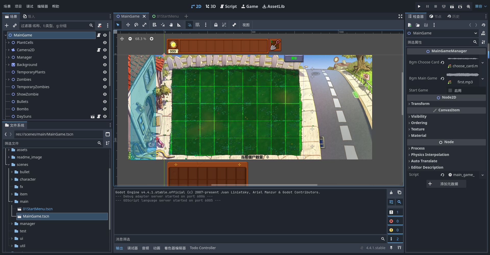
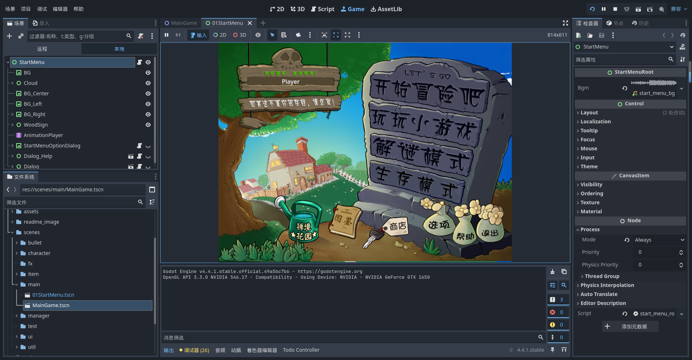

# 🌱 Multi PVZ — 多人合作版植物大战僵尸

基于 [PVZ-Godot_dream](https://github.com/hsk-dream/PVZ-Godot_dream) 开发的**多人联机合作**版本，使用 [Godot 4.6](https://godotengine.org/zh-cn/) 引擎。

2–4 名玩家共享一片草坪，协力种植植物、抵御僵尸波次！

> **考虑到版权问题，原版资源文件不包含在仓库中。**

---

## 项目展示

### 主游戏界面


### 开始菜单


---

## ✨ 联机特性

| 特性 | 说明 |
|------|------|
| **2–4 人合作** | 所有玩家共享草坪，可在任意位置种植/铲除 |
| **共享阳光池** | 阳光由 Host 权威管理，防重复收取 |
| **独立卡组** | 每位玩家独立选卡、独立冷却 |
| **多光标显示** | 实时看到其他玩家的选中状态与手持植物 |
| **难度缩放** | 僵尸数量和阳光产出随玩家人数动态调整 |
| **双连接模式** | 局域网直连 (ENet) + WebSocket 中继服务器穿透公网 |

### 难度缩放公式

| 项目 | 公式 | 2人 / 3人 / 4人 |
|------|------|------------------|
| 僵尸数量倍率 | `1 + (n-1) × 0.5` | 1.5x / 2.0x / 2.5x |
| 阳光掉落倍率 | `1 + (n-1) × 0.35` | 1.35x / 1.7x / 2.05x |
| 起始阳光 | `base × n × 0.75` | 75 / 112 / 150 |

---

## 🔧 网络架构

```
┌─────────────┐     ENet      ┌─────────────┐
│  Host (P1)  │◄────────────►│  Client (P2) │
│  权威服务器  │               ├─────────────┤
│  + 本地玩家  │◄────────────►│  Client (P3) │
│             │◄────────────►│  Client (P4) │
└─────────────┘               └─────────────┘
```

- **权威服务器模型**：所有游戏逻辑（种植验证、阳光扣除、僵尸生成、胜负判定）在 Host 端执行
- **客户端**发送操作请求，Host 验证后通过 RPC 广播结果
- 内置 WebSocket 中继服务器 (`server/relay_server.py`)，无公网 IP 也能联机

### 联机方式

**局域网直连：**
1. Host 在大厅点击"创建房间"
2. Client 输入 Host 的局域网 IP 加入

**中继服务器穿透：**
1. 部署中继服务器：`pip install websockets && python server/relay_server.py`
2. Host 创建中转房间，获取 4 位房间码
3. Client 输入服务器地址 + 房间码加入

---

## 🚀 快速开始

1. 克隆仓库
   ```bash
   git clone git@github.com:DiWu17/Multi_pvz.git
   ```
2. 用 **Godot 4.6** 打开项目
3. 准备原版 PVZ 资源文件放入 `assets/` 目录（参见下方参考资料解包教程）
4. 运行项目即可进入游戏
5. 在开始菜单进入多人大厅创建/加入房间

---

## 📂 项目结构

```
├── scripts/
│   ├── autoload/           # 全局单例（NetworkManager, EventBus 等）
│   ├── character/          # 植物/僵尸角色逻辑
│   ├── manager/            # 游戏管理器（僵尸管理、光标同步等）
│   └── ui/                 # UI 脚本（多人大厅等）
├── scenes/                 # 场景文件 (.tscn)
├── server/                 # WebSocket 中继服务器 (Python)
├── docs/                   # 开发文档 & 联机方案设计
├── addons/                 # Godot 编辑器插件
└── shaders/                # 着色器
```

---

## 🛠 开发相关

- [基于本项目开发 PVZ 改版必看内容](./docs/开发相关.md)
- [联机合作方案详细设计文档](./docs/联机合作方案.md)

### 使用的插件
- [anim_player_refactor](https://github.com/poohcom1/godot-animation-player-refactor) — AnimationPlayer 重构工具
- [R2Ga_PVZ](https://github.com/hsk-dream/PVZ_reanim2godot_animation) — PVZ 动画转 Godot 格式（[使用教程](https://www.bilibili.com/video/BV1XBKwzdELA/)）

### PVZ 相关参考资料
- [PVZ PAK 文件解包教程](https://www.bilibili.com/video/BV1JQ4y1k7KS/)
- [Godot 4 — 植物大战僵尸制作教程（已完结）](https://www.bilibili.com/video/BV1AdBtY9Ec5/)
- [R2Ga 转换器 v3.1](https://www.bilibili.com/video/BV1s3ZbY3E9L/)
- [PVZ Wiki](https://wiki.pvz1.com/doku.php?id=home)

---

## 📜 许可协议

本项目为《植物大战僵尸》复刻的学习作品，仅供个人学习与研究使用。
原作版权归 **PopCap Games** 及 **Electronic Arts (EA)** 所有，本项目不用于任何商业目的。

采用 [自定义非商用许可协议](./LICENSE)，**禁止任何形式的商业用途**。

**✅ 允许：** 个人学习、学术研究、非营利同人创作
**❌ 禁止：** 商业使用、销售、收费分发、SaaS/API 服务

---

## 🙌 致谢

致敬《植物大战僵尸》原作团队（PopCap & EA）

**上游项目：** [PVZ-Godot_dream](https://github.com/hsk-dream/PVZ-Godot_dream) by hsk-dream

### 贡献者
- 植物图鉴初稿整理：[多003_](https://space.bilibili.com/472181151)
- 宽屏素材：[豆包 AI](https://www.doubao.com/chat)

### 参考项目
- 樱桃炸弹粒子特效：[HYTommm](https://space.bilibili.com/3493140163988287) / [Godot-PVZ](https://github.com/HYTommm/Godot-PVZ)
- 信号总线 & 随机选择器：[玩物不丧志的老李](https://space.bilibili.com/8618918) / [godot_core_system](https://github.com/LiGameAcademy/godot_core_system)
- 种子雨雨幕：[简单的小雨氛围 | godot4 教程](https://www.bilibili.com/video/BV15ibAz4EZi)
